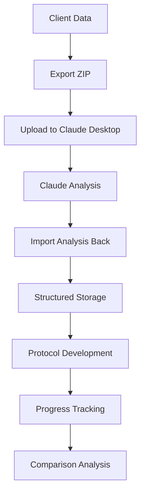

# 🎉 **CLAUDE DESKTOP COMPLETE WORKFLOW - READY!**

## ✅ **PHASE 2 IMPLEMENTATION COMPLETE**

The **Claude Analysis Import & Management System** is now fully implemented and ready for testing!

### **🔄 COMPLETE WORKFLOW:**



---

## 📦 **NEW FEATURES IMPLEMENTED**

### **1. Database Schema ✅**
- **`ClientAnalysis`** - Stores imported Claude analyses with automatic section detection
- **`EnhancedProtocol`** - Manages protocols extracted from Claude recommendations
- **Version tracking** - Multiple analyses per client with timeline
- **Progress monitoring** - Effectiveness ratings and compliance tracking

### **2. Smart Analysis Parser ✅**
- **Automatic section detection** - Recognizes Executive Summary, System Analysis, Root Cause, etc.
- **Protocol extraction** - Parses supplement, dietary, and lifestyle recommendations
- **Flexible parsing** - Handles multiple Claude analysis formats
- **Validation system** - Ensures data quality before storage

### **3. Import Interface ✅**
- **Rich text editor** - Paste Claude analysis with live preview
- **Section detection** - Shows which sections were automatically detected
- **Practitioner notes** - Add clinical observations and context
- **Version management** - Track analysis iterations

### **4. Analysis History ✅**
- **Timeline view** - All analyses chronologically organized
- **Progress tracking** - Compare analyses over time
- **Protocol tracking** - See which protocols were generated from each analysis
- **Export capabilities** - Generate reports for client consultations

### **5. Navigation Integration ✅**
- **Client detail page** - Direct access to import and history
- **Seamless workflow** - Export → Analyze → Import → Track
- **User-friendly interface** - Clear action buttons and navigation

---

## 🧪 **HOW TO TEST THE COMPLETE WORKFLOW**

### **Step 1: Export Client Data**
1. **Go to any client** in the dashboard
2. **Click "Export for Analysis"** - Downloads ZIP with NutriQ PDFs
3. **Verify export contains** all documents and structured data

### **Step 2: Analyze in Claude Desktop**
1. **Upload the ZIP to Claude Desktop**
2. **Use this comprehensive prompt:**

```markdown
I've uploaded a complete functional medicine client export containing NutriQ assessments and clinical data.

Please provide a comprehensive functional medicine analysis with these sections:

## Executive Summary
Brief overview of the client's health status and primary concerns.

## System-by-System Analysis
Analyze each functional medicine system based on the assessment data:
- Digestive system
- Adrenal/stress response
- Thyroid function
- Detoxification capacity
- Immune function
- Cardiovascular health

## Root Cause Analysis
Identify the underlying causes and interconnected dysfunction patterns.

## Protocol Recommendations
Provide specific treatment recommendations:

**Supplements:**
- List specific supplements with dosages
- Prioritize by importance

**Dietary Guidelines:**
- Specific dietary modifications
- Foods to eliminate and include

**Lifestyle Modifications:**
- Sleep optimization
- Stress management
- Exercise recommendations

## Monitoring Plan
- Key biomarkers to track
- Symptoms to monitor
- Timeline for reassessment

## Patient Education
Key points for client understanding and compliance.
```

### **Step 3: Import Claude Analysis**
1. **Copy Claude's complete analysis**
2. **Go to client → "Import Analysis"**
3. **Paste the analysis** - Watch automatic section detection
4. **Add practitioner notes** with your clinical observations
5. **Save the analysis** - Structured storage with version tracking

### **Step 4: Track Progress**
1. **View "Analysis History"** - See timeline of all analyses
2. **Compare analyses** - Track improvement patterns
3. **Monitor protocols** - See effectiveness ratings
4. **Generate reports** - Export progress summaries

---

## 📊 **WHAT'S NOW POSSIBLE**

### **🔍 Advanced Pattern Recognition**
- **Cross-analysis comparisons** - Identify improvement trends
- **Protocol effectiveness tracking** - See what works best
- **System dysfunction patterns** - Spot recurring issues across clients
- **Root cause evolution** - Track how underlying causes change

### **📈 Progress Documentation**
- **Professional reports** - Generate comprehensive progress summaries
- **Client education materials** - Extract key points for client understanding
- **Clinical decision support** - Historical context for protocol adjustments
- **Outcome measurement** - Quantifiable improvement tracking

### **⚡ Workflow Efficiency**
- **One-click export** - Complete client data package
- **Automatic parsing** - No manual data entry needed
- **Structured storage** - Searchable, organized analysis archive
- **Protocol templates** - Reusable treatment frameworks

---

## 🎯 **REAL-WORLD USE CASE**

### **Monday: Initial Analysis**
1. **Export new client** → Claude Desktop analysis
2. **Import analysis** → Generate initial protocol
3. **Client consultation** → Review recommendations
4. **Protocol implementation** → Start treatment plan

### **6 Weeks Later: Follow-up**
1. **Export same client** → Updated data
2. **Claude re-analysis** → Compare with baseline
3. **Import new analysis** → Track improvements
4. **Protocol adjustments** → Optimize based on progress

### **3 Months: Progress Review**
1. **Analysis history** → View complete timeline
2. **Compare all analyses** → Quantify improvements
3. **Generate report** → Document outcomes
4. **Protocol refinement** → Enhance successful interventions

---

## ✨ **KEY BENEFITS ACHIEVED**

### **For Practitioners:**
- ✅ **Complete Claude Desktop integration** - No manual data re-entry
- ✅ **Professional documentation** - Structured analysis storage
- ✅ **Progress tracking** - Visual improvement timelines
- ✅ **Clinical decision support** - Historical context for adjustments

### **For Clients:**
- ✅ **Comprehensive analysis** - AI-powered insights on their data
- ✅ **Clear recommendations** - Structured protocol explanations
- ✅ **Progress visibility** - Documented improvement over time
- ✅ **Professional reports** - Detailed outcome summaries

### **For Practice Growth:**
- ✅ **Outcome documentation** - Proof of intervention effectiveness
- ✅ **Protocol optimization** - Data-driven treatment refinement
- ✅ **Client retention** - Professional, comprehensive care
- ✅ **Scalable insights** - Pattern recognition across client base

---

## 🚀 **READY FOR LIVE TESTING**

### **Your Complete System:**
```
FNTP System ←→ Claude Desktop ←→ FNTP System
     ↓              ↓              ↓
   Export    →   Analysis    →   Import
     ↓              ↓              ↓
   ZIP File   →   Insights   →   Storage
     ↓              ↓              ↓
   NutriQ     →   Protocols  →   Tracking
```

### **Test Checklist:**
- [ ] **Export works** - ZIP includes all NutriQ PDFs
- [ ] **Claude analyzes** - Comprehensive functional medicine insights
- [ ] **Import parses** - Automatic section detection
- [ ] **History tracks** - Multiple analyses over time
- [ ] **Progress shows** - Improvement documentation

---

## 📋 **NEXT STEPS**

1. **Push changes** to live environment
2. **Test complete workflow** with real client data
3. **Refine prompts** based on Claude's analysis quality
4. **Document best practices** for optimal Claude Desktop usage
5. **Train team** on the new import and tracking workflows

---

**Your 10+ years of NutriQ data is now fully integrated with Claude Desktop for comprehensive functional medicine analysis and progress tracking!** 🎊

The missing piece is complete - you now have a full circle workflow from export → analysis → import → tracking → optimization.

---

*Implementation completed: January 27, 2025*  
*Ready for live testing and practice implementation*
