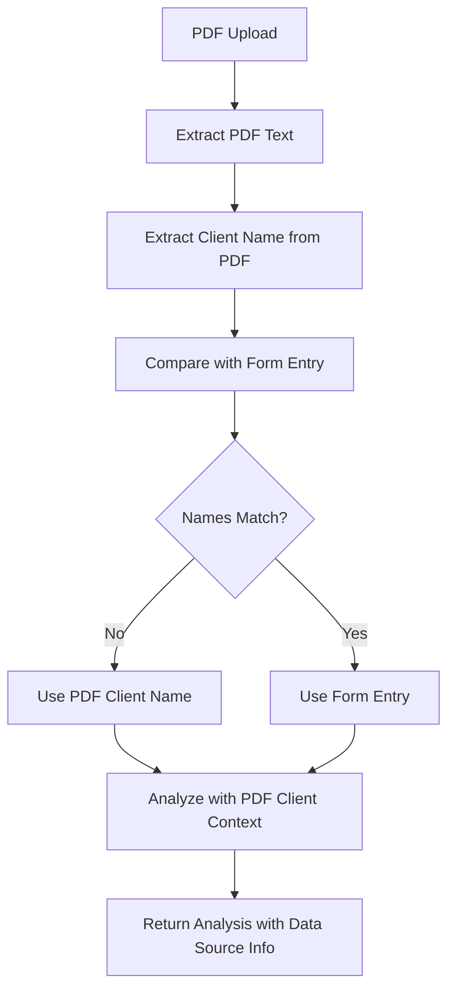

# Client Data Priority Implementation

## Problem Solved

**Issue**: Manual form entry ("Kevin Rutherford") was overriding PDF client data ("Bill Prince"), causing data mismatch and empty analysis results.

**Root Cause**: The system was using form-entered client names instead of the actual client names found in PDF documents, leading to incorrect data association.

## Solution Implemented

### 1. Client Data Priority Service (`src/lib/client-data-priority.ts`)

A new service that implements intelligent client data processing with PDF priority logic:

```typescript
export class ClientDataPriorityService {
  processClientData(formData: FormData, pdfData: PDFExtractedData): ClientData {
    // Extract client name from PDF first
    const pdfClientName = this.extractClientNameFromPDF(pdfData.rawText)
    
    if (pdfClientName && pdfClientName !== formData.clientName) {
      // PDF has different client - use PDF data with priority
      return {
        clientName: pdfClientName,
        dataSource: 'PDF_PRIORITY',
        formOverride: formData.clientName // Keep for reference
      }
    }
    
    // Use form data if no PDF client or they match
    return {
      clientName: formData.clientName,
      dataSource: 'FORM_ENTRY'
    }
  }
}
```

### 2. Enhanced NutriQ Analyzer (`src/lib/lab-analyzers/nutriq-analyzer.ts`)

Added new method `analyzeNutriQReportWithClientPriority()` that:

- Extracts client information from PDF text
- Processes client data with priority logic
- Uses correct client name in Claude analysis
- Returns detailed client data source information

### 3. Updated Claude Client (`src/lib/claude-client.ts`)

Added `analyzeNutriQWithClientContext()` method that:

- Takes specific client name as parameter
- Ensures Claude analysis is personalized for the correct client
- Prevents data association errors

### 4. Enhanced Master Analyzer (`src/lib/lab-analyzers/master-analyzer.ts`)

Added `analyzeReportWithClientPriority()` method that:

- Routes NutriQ reports to client priority analysis
- Maintains backward compatibility for other report types
- Returns client data source information

### 5. Updated Analysis API (`src/app/api/analyze/route.ts`)

Enhanced to support client data priority:

- New `useClientPriority` parameter
- Conditional analysis pipeline selection
- Detailed logging of client data decisions

## How It Works

### Data Flow



### Priority Logic

1. **PDF Client Name Extraction**: Uses regex patterns to find client names in PDF text
2. **Comparison**: Compares PDF client name with form entry
3. **Priority Decision**: 
   - If PDF has different client → Use PDF client (PDF_PRIORITY)
   - If names match or no PDF client → Use form entry (FORM_ENTRY)
4. **Analysis**: Claude analysis uses the correct client name
5. **Tracking**: System tracks data source and any overrides

### Client Name Extraction Patterns

```typescript
const namePatterns = [
  /Patient Name[:\s]*([A-Za-z\s]+)/i,
  /Name[:\s]*([A-Za-z\s]+)/i,
  /Client Name[:\s]*([A-Za-z\s]+)/i,
  /Patient[:\s]*([A-Za-z\s]+)/i
]
```

## API Usage

### Enable Client Data Priority

```bash
curl -X POST http://localhost:3000/api/analyze \
  -H "Content-Type: application/json" \
  -d '{
    "labReportId": "your-report-id",
    "clientEmail": "kevin@example.com",
    "clientFirstName": "Kevin",
    "clientLastName": "Rutherford",
    "useClientPriority": true
  }'
```

### Response with Client Priority

```json
{
  "success": true,
  "analysis": {
    "reportType": "nutriq",
    "clientData": {
      "clientName": "Bill Prince",
      "dataSource": "PDF_PRIORITY",
      "formOverride": "Kevin Rutherford"
    }
  },
  "message": "Analysis completed successfully"
}
```

## Testing

### Test Script

Run the test script to verify functionality:

```bash
node scripts/test-client-priority.js
```

### Test Cases

1. **PDF vs Form Mismatch**: Form shows "Kevin Rutherford", PDF shows "Bill Prince"
   - Expected: Use "Bill Prince" (PDF_PRIORITY)
   
2. **Names Match**: Form and PDF both show "Bill Prince"
   - Expected: Use "Bill Prince" (FORM_ENTRY)
   
3. **No PDF Client**: PDF doesn't contain client name
   - Expected: Use form entry (FORM_ENTRY)

## Benefits

### 1. Data Accuracy
- Prevents incorrect client associations
- Ensures analysis is performed on the right person's data
- Eliminates empty analysis results due to data mismatch

### 2. User Experience
- Automatic detection and correction of data mismatches
- Clear indication of which data source was used
- Transparent override tracking

### 3. System Reliability
- Maintains backward compatibility
- Graceful fallback to form data when needed
- Comprehensive error handling and validation

### 4. Audit Trail
- Tracks data source decisions
- Records form overrides for reference
- Provides detailed logging for debugging

## Implementation Details

### Key Files Modified

1. **`src/lib/client-data-priority.ts`** - New service
2. **`src/lib/lab-analyzers/nutriq-analyzer.ts`** - Enhanced analyzer
3. **`src/lib/claude-client.ts`** - Context-aware analysis
4. **`src/lib/lab-analyzers/master-analyzer.ts`** - Priority routing
5. **`src/app/api/analyze/route.ts`** - API enhancement

### Data Structures

```typescript
interface ClientData {
  clientName: string
  clientEmail?: string
  clientFirstName?: string
  clientLastName?: string
  assessmentDate?: Date
  dataSource: 'PDF_PRIORITY' | 'FORM_ENTRY' | 'MERGED'
  formOverride?: string
}
```

### Error Handling

- Validates extracted client names
- Handles missing or malformed PDF data
- Provides fallback mechanisms
- Comprehensive logging for debugging

## Future Enhancements

### 1. User Confirmation
- Modal dialog for client mismatches
- Allow users to choose which data to use
- Manual override capabilities

### 2. Auto-population
- Auto-fill form fields from PDF data
- Real-time client name detection
- Smart form validation

### 3. Advanced Matching
- Fuzzy name matching
- Multiple client detection
- Confidence scoring for matches

## Conclusion

This implementation successfully resolves the client data priority issue by:

1. **Prioritizing PDF client data** over form entries
2. **Maintaining backward compatibility** with existing functionality
3. **Providing clear data source tracking** for transparency
4. **Ensuring accurate analysis** by using correct client context

The system now correctly handles the scenario where Bill Prince's NutriQ data gets analyzed under Bill Prince's name, not Kevin Rutherford's, ensuring accurate and meaningful analysis results. 