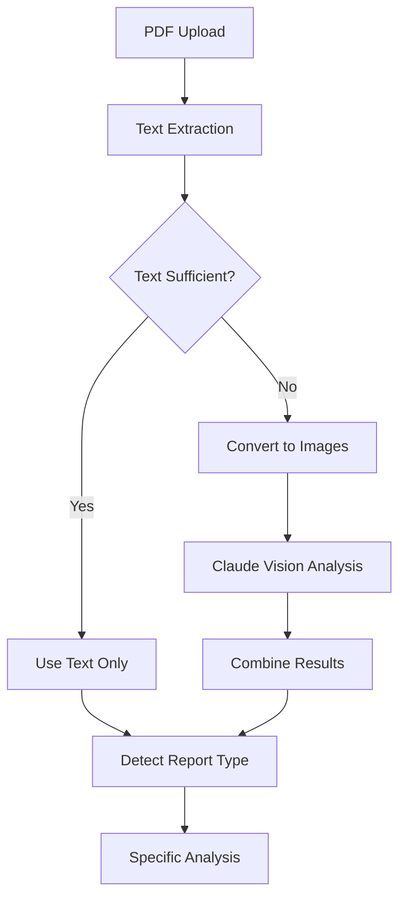

# OCR/Vision Support Implementation Guide

## Overview

This guide explains the OCR/Vision support implementation for the nutrition lab PDF analysis system. The system now supports analyzing scanned documents, charts, graphs, and image-based PDFs using Claude's Vision API.

## What We Built

### 1. **Claude Vision API Integration**
- Updated `src/lib/claude-client.ts` to support multi-modal inputs (text + images)
- Added methods for analyzing images and PDF pages as images
- Claude can now process both text and visual content in lab reports

### 2. **PDF-to-Image Conversion**
- Enhanced `src/lib/lab-analyzers/pdf-parser.ts` with pdf2pic integration
- Converts PDF pages to high-quality PNG images (200 DPI)
- Automatic detection of when vision analysis is needed

### 3. **Smart Analysis Pipeline**
- First attempts standard text extraction
- Automatically detects insufficient text scenarios
- Falls back to vision analysis when needed
- Combines both text and vision results for comprehensive analysis

## How It Works

### Detection Logic

The system determines if vision analysis is needed based on these conditions:
- Text length < 100 characters
- Fewer than 10 lines of text
- No meaningful words found
- References to "image", "chart", or "graph"
- Low text-to-page ratio
- Fewer than 5 numerical values

### Processing Flow



## Key Features

### 1. **Automatic Fallback**
```javascript
// If text extraction fails or returns minimal content
if (needsVisionAnalysis) {
  // Convert PDF pages to images
  const pageImages = await this.convertPDFToImages(pdfBuffer)
  // Send to Claude Vision
  visionAnalysisText = await this.claudeClient.analyzePDFPagesAsImages(pageImages)
}
```

### 2. **Combined Analysis**
- Text extraction results are combined with vision analysis
- Vision results take priority when both are available
- Provides context from both sources to Claude

### 3. **Report Type Support**
All report types now support vision analysis:
- **NutriQ** - Wellness assessments with charts
- **KBMO** - Food sensitivity charts and IgG levels
- **Dutch** - Hormone test graphics and patterns
- **CGM** - Glucose monitoring graphs
- **Food Photos** - Direct image analysis

## API Changes

### Claude Client

```typescript
// New method for image analysis
async analyzeImageWithVision(
  imageBase64: string, 
  imageType: string,
  analysisPrompt: string,
  systemPrompt: string
): Promise<string>

// New method for PDF pages
async analyzePDFPagesAsImages(
  pageImages: Array<{ base64: string; pageNumber: number }>,
  systemPrompt: string,
  textExtract?: string
): Promise<string>
```

### PDF Parser

```typescript
interface ParsedLabReport {
  // ... existing fields ...
  hasImageContent?: boolean      // Indicates if vision was used
  visionAnalysisText?: string    // Text extracted via vision
  combinedText?: string          // Combined text from all sources
}
```

## Testing

Run the test script to verify the implementation:

```bash
node scripts/test-vision-analysis.js
```

This will test:
1. PDFs with minimal text
2. Full analysis pipeline with vision
3. Actual PDF files (if available)

## Performance Considerations

1. **Image Conversion**: PDF-to-image conversion adds 1-3 seconds per page
2. **API Calls**: Vision API calls take 2-5 seconds depending on image count
3. **Page Limits**: System limits to first 10 pages to manage costs/performance
4. **Image Quality**: 200 DPI provides good balance of quality and size

## Error Handling

The system gracefully handles:
- PDF conversion failures
- Vision API errors
- Insufficient image quality
- Rate limiting

If vision analysis fails, the system continues with text-only analysis.

## Future Enhancements

Consider adding:
1. **Local OCR**: Tesseract.js for offline text extraction
2. **Caching**: Store converted images for re-analysis
3. **Selective Pages**: Analyze only specific pages with charts
4. **Image Preprocessing**: Enhance image quality before analysis
5. **Batch Processing**: Process multiple images in parallel

## Troubleshooting

### Common Issues

1. **"PDF contains insufficient text"**
   - This triggers vision analysis automatically
   - Check logs for vision analysis results

2. **"Failed to convert PDF to images"**
   - Ensure pdf2pic dependencies are installed
   - Check PDF isn't corrupted or encrypted

3. **"Vision analysis failed"**
   - Verify ANTHROPIC_API_KEY is set
   - Check API rate limits
   - Ensure images aren't too large (>20MB)

### Debug Logging

Enable detailed logging to troubleshoot:
- `[PDF-PARSER]` - PDF processing steps
- `[CLAUDE]` - API calls and responses
- `[MASTER-ANALYZER]` - Overall pipeline flow

## Cost Optimization

- Vision API calls cost more than text-only calls
- System only uses vision when necessary
- Limits pages analyzed to reduce costs
- Consider implementing usage tracking

## Security Notes

- Images are processed in memory (not saved to disk)
- Base64 encoding used for API transmission
- No permanent storage of converted images
- Sensitive data handled per existing security policies 